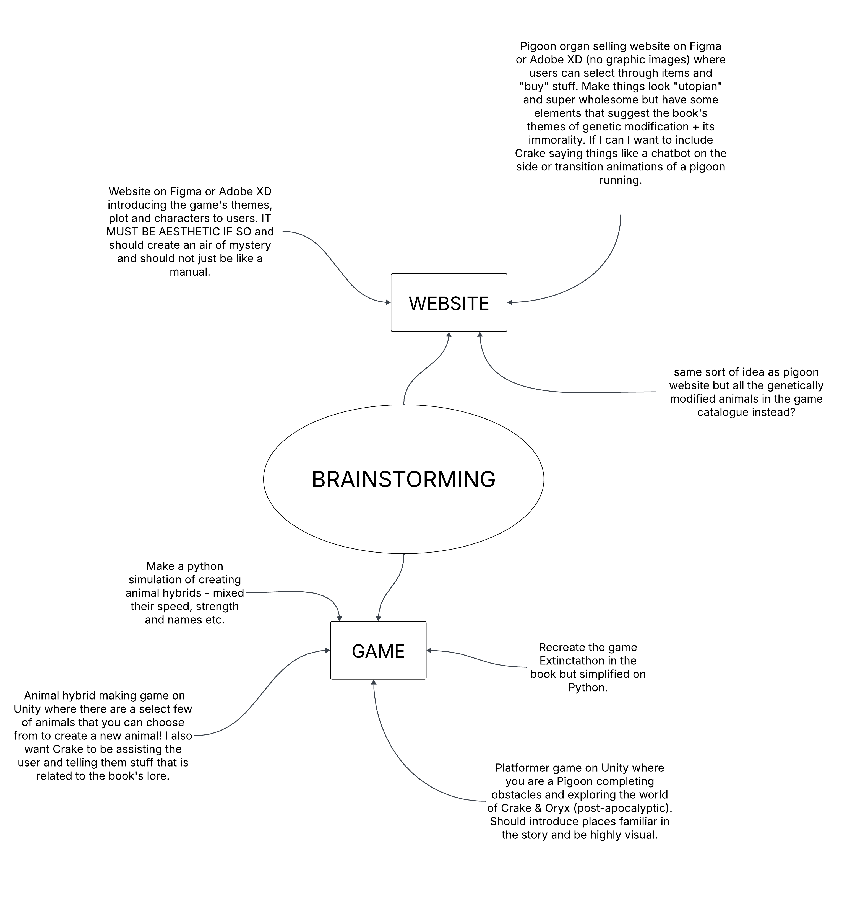

# 10CT Task 1 - Oryx & Crake UX Design
By Arisa Komatsu
## Identifying and Defining
### Project Proposal
#### Design Brief
Provide an overview of your project, including the book you have chosen, the type of user experience you are creating (e.g., website, app, video game), and your target audience.

#### Book Choice and Justification
The book I have chosen is 'Oryx & Crake' by Margaret Atwood, the first book of a trilogy called 'MaddAddam'. It follows the story of "Snowman" (previously Jimmy) and takes place in two timelines: the present, post-apocalyptic world where Snowman barely scrapes by in the wild near the human-esque creatures calle the Crakers as potentially the only human survivor left, and the past world, where bio-engineering corporations and their experiments with hybridized animals dominated society.

I have chosen this book as I find Margeret Atwood's imagination fascinating and  

Explain why you chose this book and how it inspired your project.

#### User Experience Type

Identify what format your project will take (Website, app, video game, interactive story, etc.).

Explain how this format will enhance the story or themes of the book.

#### Target Market

The target audience for my user experience are both fans of Margaret Atwook and this series 'MaddAddam', as well as young adults (preferrably 16+) interested in reading dystopian fiction. This project will appeal to the intended viewers as 

Identify the intended audience (Age group, interests, reading level, etc.).

Explain why this project will appeal to them.

Explain how your design choices will cater to this audience.

#### Software Tools
| Software/platform/tool | Reason for suitability |
|------------------------|------------------------|
| blah | 

List the software, platforms, and tools you plan to use (e.g., Adobe XD, Unity, HTML/CSS, video editing software). 

Explain why each of the above are suitable for your project.

#### Initial Brainstorming

 --------
### Requirements Specification
#### Functional Requirements
Purpose of the application 
Use Cases
Test Cases

#### Non-Functional Requirements
--------
### Social, Ethical and Legal Issues
## Researching and Planning
### Gantt Chart
----
### Research Existing UIs
----
### Research Software Options
----
### Wireframes

## Producing and Implementing
## Testing and Evaluating
### User Testing and Feedback
---
### Ongoing Evaluation
---
### Final Evaluation