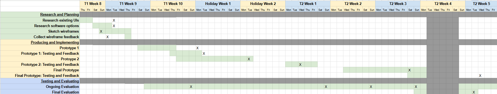
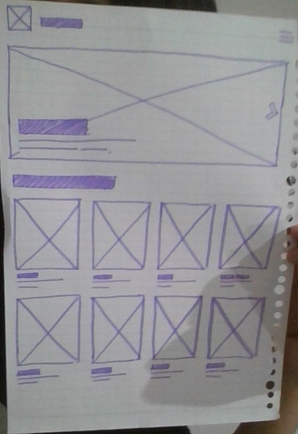
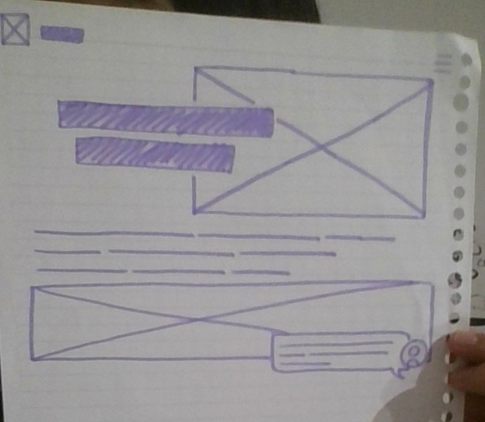
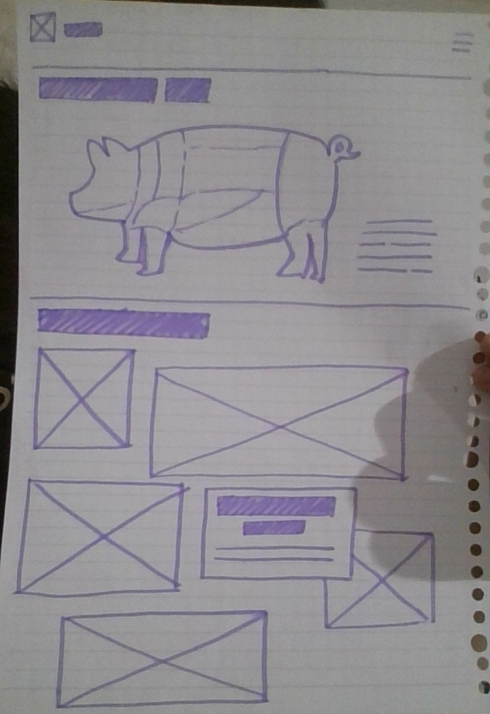
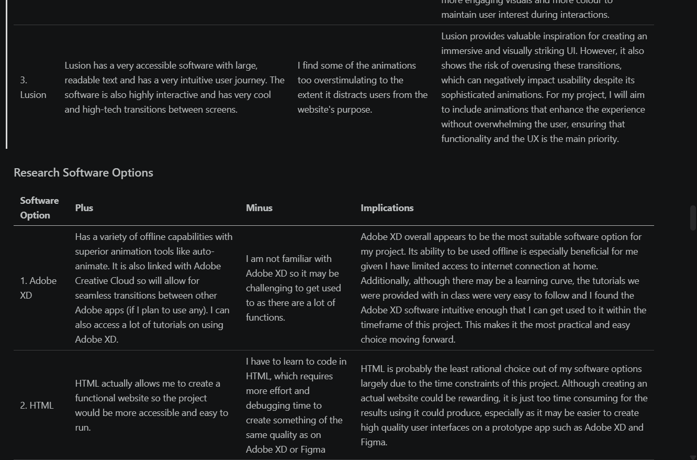
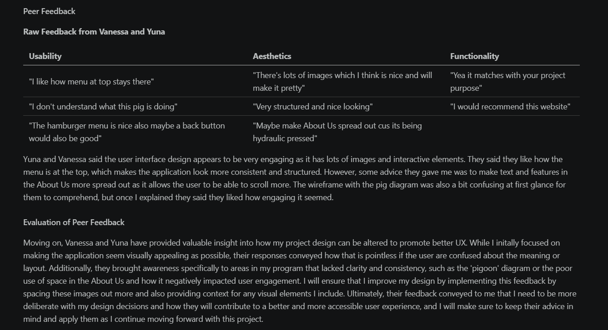
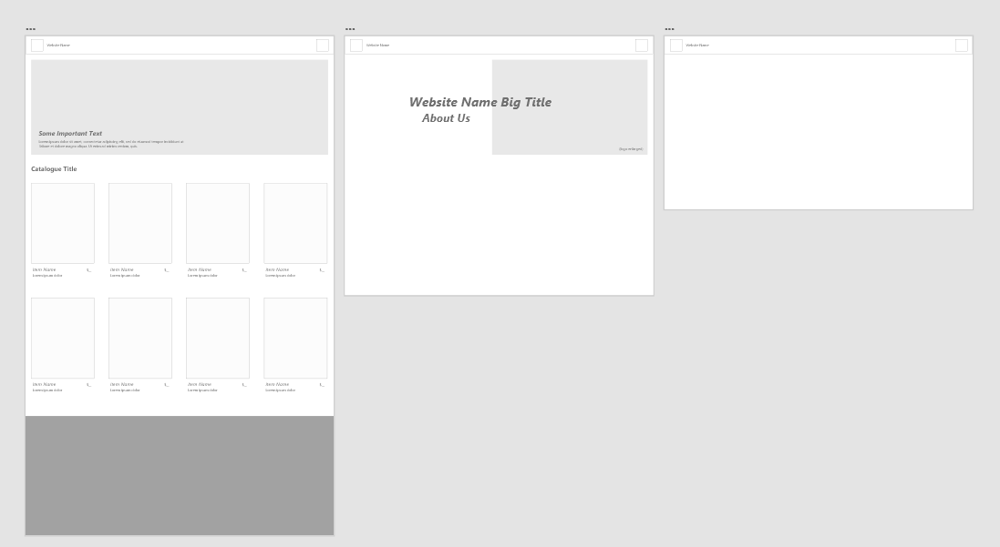
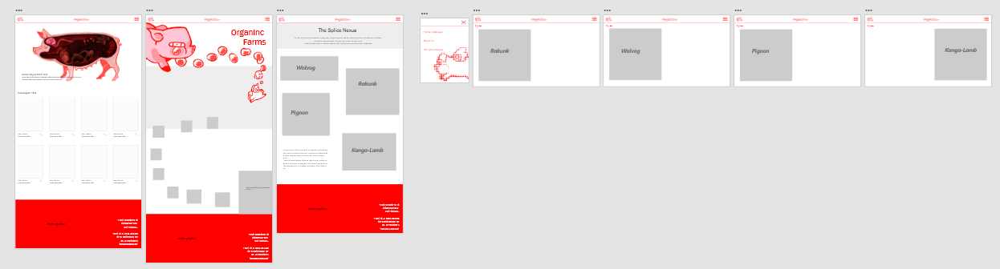
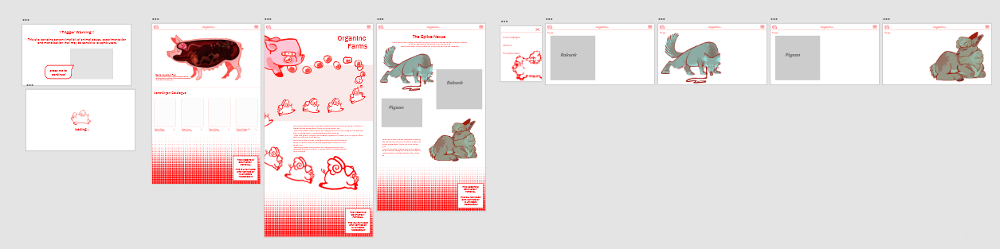

# 10CT Task 1 - Oryx & Crake UX Design
By Arisa Komatsu
## Identifying and Defining
### Project Proposal
#### Design Brief
My project is an immersive website based around the book 'Oryx & Crake' by Margaret Atwood that aims to bring fans and newcomers of the MaddAddam series into its genetic-modification themes and create a fake 'catalogue' for pigoon organ transplants made by OrganInc Farms where users can interact with and 'order', incorporating lore and themes from the series while maintaining an eerily positive atmosphere.

#### Book Choice and Justification
The book I have chosen is 'Oryx & Crake' by Margaret Atwood, the first book of a trilogy called 'MaddAddam'. It follows the story of "Snowman" (previously Jimmy) and takes place in two timelines: the present, post-apocalyptic world where Snowman barely scrapes by in the wild near the human-esque creatures calle the Crakers as potentially the only human survivor left, and the past world, where bio-engineering corporations and their experiments with hybridized animals dominated society.

I have chosen this book as I find Margeret Atwood's imagination fascinating and especially want to create an application inspired around the 'animal genetic modification' aspect of the series.

#### User Experience Type

My project will be a website as it will promote more easy accessibility with the UX, which will increase interaction and boost sharing of my project (if it were to be released publicly). Additionally, I plan to make the website seem as if it were a canonical website within the MaddAddam Universe (or have some elements that suggest this), which will overall enhance immersion with the story and concept of my chosen book.

#### Target Market

The target audience for my user experience are both fans of Margaret Atwood and this series 'MaddAddam', as well as young adults (preferrably 15+) interested in reading dystopian fiction. This project will appeal to the intended audience as viewers can learn about the series and its themes in a fun, interactive way that doesn't bore them with long informational paragraphs.

#### Software Tools
| Software/platform/tool | Reason for suitability |
|------------------------|------------------------|
| Adobe XD | Adobe XD allows for the creation of prototype websites that look realistic and aesthetically pleasing. It is highly accessible for beginners to the application and has a lot of resources and tutorials that I can learn from if needed. |
| Procreate | I would like to use procreate to create my own graphics for elements within the book like the animals and characters. Procreate is the most suitable application for this task's criteria as it is uses an intuitive software that boosts efficiency when drawing and has professional-grade brushes and tools, which will enable me to create the highest quality graphics (for my current skill level). |

#### Initial Brainstorming

**Chosen Idea:**
I chose to go with the pigoon organ shopping catalogue as I believe it is the most compelling theme within the story and can immerse readers in the book's lore as it acts as a canonical website in the actual world of MaddAddam. Although there are definitely some ethical implications I must consider with this project, creating this website can enhance this book's eerie,'utopian' mood and develop a deeper meaning in the UX by integrating the user directly into the story. This gives me the creative freedom and time compared to a video game to play around with design elements and create an aesthetic that is both appealing and relating to the series MaddAddam.

 --------
### Requirements Specification
### Functional Requirements
#### Purpose of the application 
This prototype website will allow users to the MaddAddam series' themes of genetic modification through an interactive shopping catalogue of pigoon(genetically engineered pigs with a combination of pig and human genes) organ transplants. This will allow fans of Margaret Atwood and this series to wholly engage with the dark themes within this series and explore what a world such as the dystopia within MaddAddam would be like to experience and live in.

#### Use Cases
- **Pigoon Shopping Catalogue:** This is the first page that loads when a user enters this website, where they can scroll through and click on various items. There will be a sidebar menu to the left where users can navigate and load different pages.
- **OrganInc Farm About Us:** Users can click on the website logo icon on the sidebar menu and be led to an about us about OrganInc Farms (based on lore in book)
- **Interactive Pigoon Diagram:** Users can click on a map icon on the sidebar menu and be led to a interactive diagram of a pigoon where users can hover over different parts and learn what they're used for through a little pop-up informational text.
- **Hall of Achievements (The genetically modified animal gallery):** Users can click on a medal icon on the sidebar menu and be led to a gallery of images (aka. drawings) of all the different animals that have been genetically modified both canonically in the book and some of my own creation and can scroll through freely. 

#### Test Cases
- **Pigoon Shopping Catalogue:** Test via self-testing the page is scrollable and the layout of the catalogue is correct, and verifying that the sidebar menu is always visible and clicking everywhere to ensure links work and are triggered by only intended features.
- **OrganInc Farm About Us:** Peer tests by clicking website logo icon and verify the link works, and scrolling through the page and reading to ensure that it is legible, understandable and immersive.
- **Interactive Pigoon Diagram:** Peer tests by clicking map icon to ensure it leads to the pigoon diagram page, and then clicking every area of diagram, confirming that every link works and that no unintended area can trigger any pop-ups.
- **Hall of Achievements (The genetically modified animal gallery):** Test via self-testing the gallery is scrollable, all images are loaded, and the layout looks as intended across multiple devices.

### Non-Functional Requirements
#### Performance
The system should load within 2-4 seconds (depending on if I develop a loading screen gif) and navigation between screens should occur within 1 second to ensure streamlined and natural-feeling interactions. The website should also include seamless transitions between screens such as fade ins, sliding panels or shared element transitions where needed.

#### Usability 
The website will have a consistent and cohesive design, including a suitable colour palette with adequate contrast, proper heading structures and an overall clear layout to promote easy and intuitive navigation for users. Any fonts used should be legible and font sizes should be considered carefully to maintain optimal accessibility for a range of abilities.

#### Reliability 
The reliability of the system will be ensured through proper and rigorous testing of the website across different screen sizes and devices (although my website will not be compatible with mobile devices) by multiple users to address any bugs in the system. Additionally, if my website were to be published, I would also get legal permission from the rights holder to my chosen book, Margaret Atwood, to prevent any copyright infringement and confirm the information within my website is reliable and credible.

#### Security
My website should not collect any personal user information and perform proper data minimisation as sensitive data is not required for it to function. However, if my website were to be published (as I will be making it on Adobe XD for this project), the website should utilise HTTPS to provide security for any future sensitive data that is collected, the domain should be secured, and website admin access should be limited to only authorised individials such as myself to prevent cybercriminals from accessing and altering the website content and appearance. Furthermore, regular maintenance and updating will help keep the website secure from any malware or data breaches.

--------
### Social Impact
#### Target Audience Considerations 
If launched, this application would be accessible to everyone as it will be a website, however the target audience would be young adults/adults with an interest in dystopian fiction and Margaret Atwood's works. To ensure this website is usable for a variety of abilities and devices, accessibility features must be considered, including:
- compatibility with a range of devices / usable without a mouse or keyboard
- text to speech features + alt text for images
- high colour contrast + font and font size accessibility
- any warnings/restrictions for age (if content is sensitive)

#### Potential Benefits
This project can positively impact users by encouraging more interaction with the dystopian genre and fostering a larger audience and fanbase for Margaret Atwood and her series MaddAddam. Through an immersive exploration into the series' ideas of genetic modification, it ultimately inspires deeper discusssions of the series and its ulterior implication.

#### Potential Risks 
The content of the website (focusing on pigoons and animal genetic modification) might be sensitive to certain cultures where pigs and other animals featured are seen as sacred animals such as Hinduism, Judaism, Islam etc. As Margaret Atwood's books are typically highly critical and accentuate specific aspects of society such as the prevalence of animal abuse and the framing of genetic modification as 'innovational' within this series, so it is pivotal the themes explored are both true to Atwood's intention and are tactfully presented as to not create any potential cultural insensitivity.

### Ethical Responsibilities
#### User Data & Privacy
The prototype will not collect any user data as it is not required for the system to function. However, if in future it were to collect any user data, I would ensure that sensitive personal information is not compromised by minimising and anonymising data while also notifying to users what data will be collected for what purpose at the beginning of the program to ensure fully informed consent.

#### Representation & Inclusion
This project focuses on one specific theme, animal genetic modification, that is found in the world of MaddAddam so it does not fairly represent the book series as a whole. It is meant to be an introductory immersive experience that act as means for users to find interest in Atwood's books and go read the full series for themselves, or for fans who would like to see what is like to live in the world of MaddAddam. However, to ensure that this website is kept relevant to the book series and not just some general idea, I will make sure that the 'OrganInc Farm About Us' and 'Hall of Achievements' mentions small aspects or hints to lore and the plotline in MaddAddam.

#### Content Sensitivity
As it is written by Margaret Atwood, the series MaddAddam has a handful of controversial and sensitive ideas, and the thematic content I will be exploring for this project is implicit of animal abuse, experimentation and monetisation. As my website will touch on these explicit topics like animal organ transplants, I do not want to take away from Atwood's imagination so I will promote content sensitivity by putting a trigger warning that pops up when the user opens the website for sensitive users and confirming that the website content is not real and purely based of a fictional book series. Additionally, I will make sure any visual assets I create are neither too realistic or watered down from what Atwood has created in the series, to overall allow for a immersive yet moderated representation of Crake & Oryx.

### Legal Considerations
#### Copyright & Intellectual Property + Terms of Use:
This interactive website is an entertainment-based project inspired by Oryx & Crake by Margaret Atwood. As this website is neither affliated with nor endorsed by the author or her publishers, it is pivotal to take proactive steps before publishing to avoid copyright infringement. This includes integrating a clear disclaimer at the footer of every page of the site, and creating my own original assets to avoid accidentally using official art protected by the trademark law. I will not be using any book images, quotes or fan content for my website and will be basing it purely off content within the book series MaddAddam by Margaret Atwood. 

Therefore, as all related content such as the characters, lore and settings from the book remain the intellectual property of the copyright holder (Margaret Atwood) and are protected under the Australian Copyright Act 1968, all references made to the book will be used in consideration with fair dealing principles outlined by Copyright Agency and with formal permission from Margaret Atwood if possible. Additionally, if I were to expand this website and update its features with any third-party material, they will be properly attributed or used under licences provided by Creative Commons. In this case, users will agree not to copy, reproduce, or distribute content from my site without permission, and where the creator (me) will not be liable for any misuse of the provided content. 

## Researching and Planning
### Gantt Chart

### Research Existing UIs
| UI Name | Plus | Minus | Implications |
|-|-|-|-|
|1. North Sea Chefs | The North Sea Chefs has several interactive elements, cool transitions and animations. I specifically like the swimming fish at the very bottom of the page, as well as how the marine animals change colours when you hover your cursor over it. Overall, these elements and visual imagery just help to nurture a more immersive UX without being too overstimulating. The structure of the website is also very consistent and easy to navigate, and the colours of the website are iconic and related to the website purpose. | I don't really have anything bad to say about this website, perhaps the colour scheme has too much contrast for my liking and the first image that pops up on the main menu is a bit blurry and pixelated, which negatively impacts UX. | Ultimately, I believe the North Sea Chefs website is a key example I will be referencing during this project as several elements and aspects specifically in the animations and transitions align with my project vision. Although this website's content is a bit different from my project's, with proper consideration of my project intention, I think I can integrate several ideas from North Sea Chefs into my application to improve its interactivity and immersiveness. |
|2. Cotton On | I like how the images of the clothing move when your cursor hovers over it. The catalogue also has an easy, understandable structure and allows users to scroll intuitively. | The Cotton On website is too minimalistic for my taste as the monotone colour scheme together with buttons with lots of text make the interface feel very cluttered, especially at the top of the screen. | Cotton On overall demonstrates the importance of clear navigation and clarity in a UI, especially providing as an example for the catalogue feature of my project design plan. However, it also highlights how being too minimalistic can make an interface’s design seem cluttered and disengaging. For my project, I will aim to be inspired off Cotton On’s simple catalogue layout while incorporating more engaging visuals and more colour to maintain user interest during interactions. |
|3. Lusion |Lusion has a very accessible software with large, readable text and has a very intuitive user journey. The software is also highly interactive and has very cool and high-tech transitions between screens. | I find some of the animations too overstimulating to the extent it distracts users from the website's purpose. | Lusion provides valuable inspiration for creating an immersive and visually striking UI. However, it also shows the risk of overusing these transitions, which can negatively impact usability despite its sophisticated animations. For my project, I will aim to include animations that enhance the experience without overwhelming the user, ensuring that functionality and the UX is the main priority.|

### Research Software Options
| Software Option | Plus | Minus | Implications |
|-|-|-|-|
|1. Adobe XD| Has a variety of offline capabilities with superior animation tools like auto-animate. It is also linked with Adobe Creative Cloud so will allow for seamless transitions between other Adobe apps (if I plan to use any). I can also access a lot of tutorials on using Adobe XD. | I am not familiar with Adobe XD so it may be challenging to get used to as there are a lot of functions. | Adobe XD overall appears to be the most suitable software option for my project. Its ability to be used offline is especially beneficial for me given I have limited access to internet connection at home. Additionally, although there may be a learning curve, the tutorials we were provided with in class were very easy to follow and I found the Adobe XD software intuitive enough that I can get used to it within the timeframe of this project. This makes it the most practical and easy choice moving forward. |
|2. HTML | HTML actually allows me to create a functional website so the project would be more accessible and easy to run. | I have to learn to code in HTML, which requires more effort and debugging time to create something of the same quality as on Adobe XD or Figma | HTML is probably the least rational choice out of my software options largely due to the time constraints of this project. Although creating an actual website could be rewarding, it is just too time consuming for the results using it could produce, especially as it may be easier to create high quality user interfaces on a prototype app such as Adobe XD and Figma. |
|3. Figma | Figma has a broad variety of component libraries and there are plenty of Figma tutorials within the app itself. It is also a web-based application so I can access it from any device without downloading (which means I can work from my Chromebook) | Figma is internet dependent so I cannot work on it offline and users report that large files can lead to a lot of lagging and crashing. | Figma is a strong alternative to Adobe XD because it is intuitive, easy to learn, and well suited for designing high-quality user interfaces. Its web-based nature also allows me to work across multiple devices, including my Chromebook, which adds flexibility. However, since my internet access at home is sometimes limited, there may be occasional interruptions to my workflow. Despite this, I could still use Figma effectively by planning my work around when the internet is available. Overall, Figma is a practical option, but Adobe XD remains slightly more reliable for consistent progress. |

### Wireframes

#### Peer Feedback 

**Raw Feedback from Vanessa and Yuna**
| Usability | Aesthetics | Functionality |
|-|-|-|
|"I like how menu at top stays there"| "There's lots of images which I think is nice and will make it pretty" | "Yea it matches with your project purpose" |
|"I don't understand what this pig is doing" | "Very structured and nice looking" | "I would recommend this website" |
|"The hamburger menu is nice also maybe a back button would also be good" | "Maybe make About Us spread out cus its being hydraulic pressed"|

Yuna and Vanessa said the user interface design appears to be very engaging as it has lots of images and interactive elements. They said they like how the menu is at the top, which makes the application look more consistent and structured. However, some advice they gave me was to make text and features in the About Us more spread out as it allows the user to be able to scroll more. The wireframe with the pig diagram was also a bit confusing at first glance for them to comprehend, but once I explained they said they liked how engaging it seemed. 

#### Evaluation of Peer Feedback
Moving on, Vanessa and Yuna have provided valuable insight into how my project design can be altered to promote better UX. While I initally focused on making the application seem visually appealing as possible, their responses conveyed how that is pointless if the user are confused about the meaning or layout. Additionally, they brought awareness specifically to areas in my program that lacked clarity and consistency, such as the 'pigoon' diagram or the poor use of space in the About Us and how it negatively impacted user engagement. I will ensure that I improve my design by implementing this feedback by spacing these images out more and also providing context for any visual elements I include. Ultimately, their feedback conveyed to me that I need to be more deliberate with my design decisions and how they will contribute to a better and more accessible user experience, and I will make sure to keep their advice in mind and apply them as I continue moving forward with this project. 

## Testing and Evaluating
### Prototype 1
#### User Testing and Feedback
**Received Feedback (from questionnaire)**
| Questions | Yuna | Ayane |
|--|--|--|
| How easy is the layout to understand? (1-5) | 5 | 5 |
| What do you think of the interface in terms of structure and its use of space? | The program uses the space very well and makes it really interesting due to the different designs on each page. Very visually appealing and nice to look at. Its very structured and easy to understand without being to confusing. Just the right about of complexity. | very structured and easy to understand and space is used well so there's no areas that feel too empty or too cluttered |
| How intuitive do you find the interface? (1-5) | 5 | 4 |
| What features affect how intuitive you find the interface? Did you have any issues when navigating? | It was really easy to navigate but i did mistake the logo and thought it was a button (but thats just me...). I think it would be nice to have a back button and a button to take you back to the main home screen so that the user wont have to continuously press the menu button to go back to the page before or the main page. But the menu button looked really pretty | no I didn't and the interface is mostly very intuitive and I can navigate it easily but I didnt know the animals were buttons in the splice nexus thing until you told me so I think there should be a clear indicator for that - I like the back buttons for the animal pages though |
| What do you think of the interface in terms of response time and overall performance? | Fast response time with no lags and great overall performance. Very interactive and interesting and captivating. | fast but plain because it doesnt have much transitions |
Do you have any other feedback? (in terms of performance, accessibility, structure etc.) | no | no |

#### User Testing Evaluation
The feedback I received from my quesetionnaire was mostly positive, but I also received a lot of valuable insight in improving the UX moving forward with the project. Both responses outlined that the prototype is highly intuitive and user-friendly, with slight areas of improvement in terms of navigation (making a back button, making the logo a button). They stated that the design elements are very interesting and interactive, however it was not as accessible as it could be as it lacked clarity in how to interact with some of the elements such as the Splice Nexus.
The advice I received from questionnaire responses were quite similar, as they both highlighted how they liked the layout but found some weaknesses in the interface's intuitiveness, which emphasises to me that for my prototype 2, I need to focus on bringing more clarity in user navigation and optimising features so the UI is not only interactive, but convenient/easy to use.

### Prototype 2
#### User Testing and Feedback
#### User Testing Evaluation
Analyse the key themes that emerged from user feedback and their overall impact on the project.

Evaluate how intuitive and user-friendly the prototype was based on user feedback.

Analyse whether the design elements and accessibility features effectively met user needs.

Evaluate the performance of the prototype, including any issues related to speed, responsiveness, or compatibility.

Analyse the similarities and differences between survey responses and interview insights to identify patterns.

Evaluate the most critical areas for improvement and how they should be addressed in the next sprint.

### Prototype 3
#### User Testing and Feedback
#### User Testing Evaluation
Analyse the key themes that emerged from user feedback and their overall impact on the project.

Evaluate how intuitive and user-friendly the prototype was based on user feedback.

Analyse whether the design elements and accessibility features effectively met user needs.

Evaluate the performance of the prototype, including any issues related to speed, responsiveness, or compatibility.

Analyse the similarities and differences between survey responses and interview insights to identify patterns.

Evaluate the most critical areas for improvement and how they should be addressed in the next sprint.

### Ongoing Evaluation (weekly)
**5/04/26 T1 Week 10**
| Term(x) Week(y) | Screenshots | Progress Report|
|-|-|-|
| T1 W10 |   | I finished all the theory work in the design stage of the SDLC, including the research and peer feedback and self evaluations of the wireframes. The most important design decision I've made so far is to utilise Adobe XD for my project, as it dictates what the final product will look like and defines what technical skills I need moving on for this project. I've already started Prototype 1 on Adobe XD but I'm planning to make some changes from my original wireframes based on feedback I was given. Overall, my time management hasn't been very good these past few weeks, but I haven't had any issues this week and I'm catching up which is good. Next week, I just need to focus on finishing prototype 1 and getting user testing and feedback ASAP so I can get started on prototype 2 before the holidays ends. |
| T2 W1 | | |
| T2 W2 || |
| T2 W3 | | |
| T2 W5 | | |

Outline your progress this week, including key tasks completed and any challenges you encountered.

Analyse the most important design or functionality decisions you made and justify your choices.

Explain how you approached and resolved any difficulties or obstacles this week.

Evaluate your time management and workflow—what strategies were effective, and what could be improved?

Outline your priorities for next week—what specific areas need further development or refinement?

### Final Evaluation
1. **Evaluate how effectively your product meets the functional and non-functional requirements, including its stated purpose, use case flows, expected behaviours, usability, performance, reliability, and any relevant security considerations.**

2. Evaluate how well your final product meets the intentions outlined in your design brief, including suitability for the target audience and purpose.

3. Evaluate the extent to which your project addresses relevant social, ethical, and legal responsibilities, particularly in relation to the chosen book and user experience.

4. Evaluate how effectively you managed your time, resources, and processes throughout the project, including how well you met milestones, adapted to challenges, and maintained consistent progress.

5. Evaluate how effectively you gathered and responded to user feedback and testing with consideration to how it influenced your design decisions and what aspects of the product still require improvement.