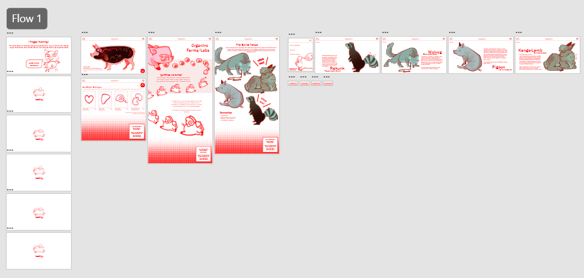

# 10CT Task 1 - Oryx & Crake UX Design
By Arisa Komatsu
## Identifying and Defining
### Project Proposal
#### Design Brief
My project is an immersive website based around the book 'Oryx & Crake' by Margaret Atwood that aims to bring fans and newcomers of the MaddAddam series into its genetic-modification themes and create a fake 'catalogue' for pigoon organ transplants made by OrganInc Farms where users can interact with and 'order', incorporating lore and themes from the series while maintaining an eerily positive atmosphere.

#### Book Choice and Justification
The book I have chosen is 'Oryx & Crake' by Margaret Atwood, the first book of a trilogy called 'MaddAddam'. It follows the story of "Snowman" (previously Jimmy) and takes place in two timelines: the present, post-apocalyptic world where Snowman barely scrapes by in the wild near the human-esque creatures calle the Crakers as potentially the only human survivor left, and the past world, where bio-engineering corporations and their experiments with hybridized animals dominated society.

I have chosen this book as I find Margeret Atwood's imagination fascinating and especially want to create an application inspired around the 'animal genetic modification' aspect of the series.

#### User Experience Type

My project will be a website as it will promote more easy accessibility with the UX, which will increase interaction and boost sharing of my project (if it were to be released publicly). Additionally, I plan to make the website seem as if it were a canonical website within the MaddAddam Universe (or have some elements that suggest this), which will overall enhance immersion with the story and concept of my chosen book.

#### Target Market

The target audience for my user experience are both fans of Margaret Atwood and this series 'MaddAddam', as well as young adults (preferrably 15+) interested in reading dystopian fiction. This project will appeal to the intended audience as viewers can learn about the series and its themes in a fun, interactive way that doesn't bore them with long informational paragraphs.

#### Software Tools
| Software/platform/tool | Reason for suitability |
|------------------------|------------------------|
| Adobe XD | Adobe XD allows for the creation of prototype websites that look realistic and aesthetically pleasing. It is highly accessible for beginners to the application and has a lot of resources and tutorials that I can learn from if needed. |
| Procreate | I would like to use procreate to create my own graphics for elements within the book like the animals and characters. Procreate is the most suitable application for this task's criteria as it is uses an intuitive software that boosts efficiency when drawing and has professional-grade brushes and tools, which will enable me to create the highest quality graphics (for my current skill level). |

#### Initial Brainstorming

**Chosen Idea:**
I chose to go with the pigoon organ shopping catalogue as I believe it is the most compelling theme within the story and can immerse readers in the book's lore as it acts as a canonical website in the actual world of MaddAddam. Although there are definitely some ethical implications I must consider with this project, creating this website can enhance this book's eerie,'utopian' mood and develop a deeper meaning in the UX by integrating the user directly into the story. This gives me the creative freedom and time compared to a video game to play around with design elements and create an aesthetic that is both appealing and relating to the series MaddAddam.

 --------
### Requirements Specification
### Functional Requirements
#### Purpose of the application 
This prototype website will allow users to the MaddAddam series' themes of genetic modification through an interactive shopping catalogue of pigoon(genetically engineered pigs with a combination of pig and human genes) organ transplants. This will allow fans of Margaret Atwood and this series to wholly engage with the dark themes within this series and explore what a world such as the dystopia within MaddAddam would be like to experience and live in.

#### Use Cases
- **Pigoon Shopping Catalogue:** This is the first page that loads when a user enters this website, where they can scroll through and click on various items. There will be a sidebar menu to the left where users can navigate and load different pages.
- **OrganInc Farm About Us:** Users can click on the website logo icon on the sidebar menu and be led to an about us about OrganInc Farms (based on lore in book)
- **Interactive Pigoon Diagram:** Users can click on a map icon on the sidebar menu and be led to a interactive diagram of a pigoon where users can hover over different parts and learn what they're used for through a little pop-up informational text.
- **Hall of Achievements (The genetically modified animal gallery):** Users can click on a medal icon on the sidebar menu and be led to a gallery of images (aka. drawings) of all the different animals that have been genetically modified both canonically in the book and some of my own creation and can scroll through freely. 

#### Test Cases
- **Pigoon Shopping Catalogue:** Test via self-testing the page is scrollable and the layout of the catalogue is correct, and verifying that the sidebar menu is always visible and clicking everywhere to ensure links work and are triggered by only intended features.
- **OrganInc Farm About Us:** Peer tests by clicking website logo icon and verify the link works, and scrolling through the page and reading to ensure that it is legible, understandable and immersive.
- **Interactive Pigoon Diagram:** Peer tests by clicking map icon to ensure it leads to the pigoon diagram page, and then clicking every area of diagram, confirming that every link works and that no unintended area can trigger any pop-ups.
- **Hall of Achievements (The genetically modified animal gallery):** Test via self-testing the gallery is scrollable, all images are loaded, and the layout looks as intended across multiple devices.

### Non-Functional Requirements
#### Performance
The system should load within 2-4 seconds (depending on if I develop a loading screen gif) and navigation between screens should occur within 1 second to ensure streamlined and natural-feeling interactions. The website should also include seamless transitions between screens such as fade ins, sliding panels or shared element transitions where needed.

#### Usability 
The website will have a consistent and cohesive design, including a suitable colour palette with adequate contrast, proper heading structures and an overall clear layout to promote easy and intuitive navigation for users. Any fonts used should be legible and font sizes should be considered carefully to maintain optimal accessibility for a range of abilities.

#### Reliability 
The reliability of the system will be ensured through proper and rigorous testing of the website across different screen sizes and devices (although my website will not be compatible with mobile devices) by multiple users to address any bugs in the system. Additionally, if my website were to be published, I would also get legal permission from the rights holder to my chosen book, Margaret Atwood, to prevent any copyright infringement and confirm the information within my website is reliable and credible.

#### Security
My website should not collect any personal user information and perform proper data minimisation as sensitive data is not required for it to function. However, if my website were to be published (as I will be making it on Adobe XD for this project), the website should utilise HTTPS to provide security for any future sensitive data that is collected, the domain should be secured, and website admin access should be limited to only authorised individials such as myself to prevent cybercriminals from accessing and altering the website content and appearance. Furthermore, regular maintenance and updating will help keep the website secure from any malware or data breaches.

--------
### Social Impact
#### Target Audience Considerations 
If launched, this application would be accessible to everyone as it will be a website, however the target audience would be young adults/adults with an interest in dystopian fiction and Margaret Atwood's works. To ensure this website is usable for a variety of abilities and devices, accessibility features must be considered, including:
- compatibility with a range of devices / usable without a mouse or keyboard
- text to speech features + alt text for images
- high colour contrast + font and font size accessibility
- any warnings/restrictions for age (if content is sensitive)

#### Potential Benefits
This project can positively impact users by encouraging more interaction with the dystopian genre and fostering a larger audience and fanbase for Margaret Atwood and her series MaddAddam. Through an immersive exploration into the series' ideas of genetic modification, it ultimately inspires deeper discusssions of the series and its ulterior implication.

#### Potential Risks 
The content of the website (focusing on pigoons and animal genetic modification) might be sensitive to certain cultures where pigs and other animals featured are seen as sacred animals such as Hinduism, Judaism, Islam etc. As Margaret Atwood's books are typically highly critical and accentuate specific aspects of society such as the prevalence of animal abuse and the framing of genetic modification as 'innovational' within this series, so it is pivotal the themes explored are both true to Atwood's intention and are tactfully presented as to not create any potential cultural insensitivity.

### Ethical Responsibilities
#### User Data & Privacy
The prototype will not collect any user data as it is not required for the system to function. However, if in future it were to collect any user data, I would ensure that sensitive personal information is not compromised by minimising and anonymising data while also notifying to users what data will be collected for what purpose at the beginning of the program to ensure fully informed consent.

#### Representation & Inclusion
This project focuses on one specific theme, animal genetic modification, that is found in the world of MaddAddam so it does not fairly represent the book series as a whole. It is meant to be an introductory immersive experience that act as means for users to find interest in Atwood's books and go read the full series for themselves, or for fans who would like to see what is like to live in the world of MaddAddam. However, to ensure that this website is kept relevant to the book series and not just some general idea, I will make sure that the 'OrganInc Farm About Us' and 'Hall of Achievements' mentions small aspects or hints to lore and the plotline in MaddAddam.

#### Content Sensitivity
As it is written by Margaret Atwood, the series MaddAddam has a handful of controversial and sensitive ideas, and the thematic content I will be exploring for this project is implicit of animal abuse, experimentation and monetisation. As my website will touch on these explicit topics like animal organ transplants, I do not want to take away from Atwood's imagination so I will promote content sensitivity by putting a trigger warning that pops up when the user opens the website for sensitive users and confirming that the website content is not real and purely based of a fictional book series. Additionally, I will make sure any visual assets I create are neither too realistic or watered down from what Atwood has created in the series, to overall allow for a immersive yet moderated representation of Crake & Oryx.

### Legal Considerations
#### Copyright & Intellectual Property + Terms of Use:
This interactive website is an entertainment-based project inspired by Oryx & Crake by Margaret Atwood. As this website is neither affliated with nor endorsed by the author or her publishers, it is pivotal to take proactive steps before publishing to avoid copyright infringement. This includes integrating a clear disclaimer at the footer of every page of the site, and creating my own original assets to avoid accidentally using official art protected by the trademark law. I will not be using any book images, quotes or fan content for my website and will be basing it purely off content within the book series MaddAddam by Margaret Atwood. 

Therefore, as all related content such as the characters, lore and settings from the book remain the intellectual property of the copyright holder (Margaret Atwood) and are protected under the Australian Copyright Act 1968, all references made to the book will be used in consideration with fair dealing principles outlined by Copyright Agency and with formal permission from Margaret Atwood if possible. Additionally, if I were to expand this website and update its features with any third-party material, they will be properly attributed or used under licences provided by Creative Commons. In this case, users will agree not to copy, reproduce, or distribute content from my site without permission, and where the creator (me) will not be liable for any misuse of the provided content. 

## Researching and Planning
### Gantt Chart

### Research Existing UIs
| UI Name | Plus | Minus | Implications |
|-|-|-|-|
|1. North Sea Chefs | The North Sea Chefs has several interactive elements, cool transitions and animations. I specifically like the swimming fish at the very bottom of the page, as well as how the marine animals change colours when you hover your cursor over it. Overall, these elements and visual imagery just help to nurture a more immersive UX without being too overstimulating. The structure of the website is also very consistent and easy to navigate, and the colours of the website are iconic and related to the website purpose. | I don't really have anything bad to say about this website, perhaps the colour scheme has too much contrast for my liking and the first image that pops up on the main menu is a bit blurry and pixelated, which negatively impacts UX. | Ultimately, I believe the North Sea Chefs website is a key example I will be referencing during this project as several elements and aspects specifically in the animations and transitions align with my project vision. Although this website's content is a bit different from my project's, with proper consideration of my project intention, I think I can integrate several ideas from North Sea Chefs into my application to improve its interactivity and immersiveness. |
|2. Cotton On | I like how the images of the clothing move when your cursor hovers over it. The catalogue also has an easy, understandable structure and allows users to scroll intuitively. | The Cotton On website is too minimalistic for my taste as the monotone colour scheme together with buttons with lots of text make the interface feel very cluttered, especially at the top of the screen. | Cotton On overall demonstrates the importance of clear navigation and clarity in a UI, especially providing as an example for the catalogue feature of my project design plan. However, it also highlights how being too minimalistic can make an interface’s design seem cluttered and disengaging. For my project, I will aim to be inspired off Cotton On’s simple catalogue layout while incorporating more engaging visuals and more colour to maintain user interest during interactions. |
|3. Lusion |Lusion has a very accessible software with large, readable text and has a very intuitive user journey. The software is also highly interactive and has very cool and high-tech transitions between screens. | I find some of the animations too overstimulating to the extent it distracts users from the website's purpose. | Lusion provides valuable inspiration for creating an immersive and visually striking UI. However, it also shows the risk of overusing these transitions, which can negatively impact usability despite its sophisticated animations. For my project, I will aim to include animations that enhance the experience without overwhelming the user, ensuring that functionality and the UX is the main priority.|

### Research Software Options
| Software Option | Plus | Minus | Implications |
|-|-|-|-|
|1. Adobe XD| Has a variety of offline capabilities with superior animation tools like auto-animate. It is also linked with Adobe Creative Cloud so will allow for seamless transitions between other Adobe apps (if I plan to use any). I can also access a lot of tutorials on using Adobe XD. | I am not familiar with Adobe XD so it may be challenging to get used to as there are a lot of functions. | Adobe XD overall appears to be the most suitable software option for my project. Its ability to be used offline is especially beneficial for me given I have limited access to internet connection at home. Additionally, although there may be a learning curve, the tutorials we were provided with in class were very easy to follow and I found the Adobe XD software intuitive enough that I can get used to it within the timeframe of this project. This makes it the most practical and easy choice moving forward. |
|2. HTML | HTML actually allows me to create a functional website so the project would be more accessible and easy to run. | I have to learn to code in HTML, which requires more effort and debugging time to create something of the same quality as on Adobe XD or Figma | HTML is probably the least rational choice out of my software options largely due to the time constraints of this project. Although creating an actual website could be rewarding, it is just too time consuming for the results using it could produce, especially as it may be easier to create high quality user interfaces on a prototype app such as Adobe XD and Figma. |
|3. Figma | Figma has a broad variety of component libraries and there are plenty of Figma tutorials within the app itself. It is also a web-based application so I can access it from any device without downloading (which means I can work from my Chromebook) | Figma is internet dependent so I cannot work on it offline and users report that large files can lead to a lot of lagging and crashing. | Figma is a strong alternative to Adobe XD because it is intuitive, easy to learn, and well suited for designing high-quality user interfaces. Its web-based nature also allows me to work across multiple devices, including my Chromebook, which adds flexibility. However, since my internet access at home is sometimes limited, there may be occasional interruptions to my workflow. Despite this, I could still use Figma effectively by planning my work around when the internet is available. Overall, Figma is a practical option, but Adobe XD remains slightly more reliable for consistent progress. |

### Wireframes

#### Peer Feedback 

**Raw Feedback from Vanessa and Yuna**
| Usability | Aesthetics | Functionality |
|-|-|-|
|"I like how menu at top stays there"| "There's lots of images which I think is nice and will make it pretty" | "Yea it matches with your project purpose" |
|"I don't understand what this pig is doing" | "Very structured and nice looking" | "I would recommend this website" |
|"The hamburger menu is nice also maybe a back button would also be good" | "Maybe make About Us spread out cus its being hydraulic pressed"|

Yuna and Vanessa said the user interface design appears to be very engaging as it has lots of images and interactive elements. They said they like how the menu is at the top, which makes the application look more consistent and structured. However, some advice they gave me was to make text and features in the About Us more spread out as it allows the user to be able to scroll more. The wireframe with the pig diagram was also a bit confusing at first glance for them to comprehend, but once I explained they said they liked how engaging it seemed. 

#### Evaluation of Peer Feedback
Moving on, Vanessa and Yuna have provided valuable insight into how my project design can be altered to promote better UX. While I initally focused on making the application seem visually appealing as possible, their responses conveyed how that is pointless if the user are confused about the meaning or layout. Additionally, they brought awareness specifically to areas in my program that lacked clarity and consistency, such as the 'pigoon' diagram or the poor use of space in the About Us and how it negatively impacted user engagement. I will ensure that I improve my design by implementing this feedback by spacing these images out more and also providing context for any visual elements I include. Ultimately, their feedback conveyed to me that I need to be more deliberate with my design decisions and how they will contribute to a better and more accessible user experience, and I will make sure to keep their advice in mind and apply them as I continue moving forward with this project. 

## Testing and Evaluating
### Prototype 1
#### User Testing and Feedback
**Received Feedback (from questionnaire)**
| Questions | Yuna | Ayane |
|--|--|--|
| How easy is the layout to understand? (1-5) | 5 | 5 |
| What do you think of the interface in terms of structure and its use of space? | The program uses the space very well and makes it really interesting due to the different designs on each page. Very visually appealing and nice to look at. Its very structured and easy to understand without being to confusing. Just the right about of complexity. | very structured and easy to understand and space is used well so there's no areas that feel too empty or too cluttered |
| How intuitive do you find the interface? (1-5) | 5 | 4 |
| What features affect how intuitive you find the interface? Did you have any issues when navigating? | It was really easy to navigate but i did mistake the logo and thought it was a button (but thats just me...). I think it would be nice to have a back button and a button to take you back to the main home screen so that the user wont have to continuously press the menu button to go back to the page before or the main page. But the menu button looked really pretty | no I didn't and the interface is mostly very intuitive and I can navigate it easily but I didnt know the animals were buttons in the splice nexus thing until you told me so I think there should be a clear indicator for that - I like the back buttons for the animal pages though |
| What do you think of the interface in terms of response time and overall performance? | Fast response time with no lags and great overall performance. Very interactive and interesting and captivating. | fast but plain because it doesnt have much transitions |
Do you have any other feedback? (in terms of performance, accessibility, structure etc.) | no | no |

#### User Testing Evaluation
The feedback I received from my questionnaire was mostly positive, but I also received a lot of valuable insight in improving the UX moving forward with the project. Both responses outlined that the prototype is highly intuitive and user-friendly, with slight areas of improvement in terms of navigation (making a back button, making the logo a button). They stated that the design elements are very interesting and interactive, however it was not as accessible as it could be as it lacked clarity in how to interact with some of the elements such as the Splice Nexus.
The advice I received from questionnaire responses were quite similar, as they both highlighted how they liked the layout but found some weaknesses in the interface's intuitiveness, which emphasises to me that for my prototype 2, I need to focus on bringing more clarity in user navigation and optimising features so the UI is not only interactive, but convenient/easy to use.

### Prototype 2
#### User Testing and Feedback
**Interview Responses: Vanessa**
| Questions | Response | 
|-|-| 
| How intuitive do you find the program? | "very intuitive. it has the basic like website structure with the hamburger menu and stuff" |
| What features helped the program feel more (or less) intuitive? | "I like the click me icons that guides people to click the elements so it's very easy to use and navigate.I also like how the pig's organs are half tones so you know where to press."|
|Do you think the application will be accessible to a variety of abilities? | "yeah it has good contrast, lots of elements and little text" |
|What did you think in terms of the design elements?| "You're graphics soo good bro. I love love the animations it makes it feel animated and jumpy and it's cool and the fade at the end of each page is really nice." | 
| What features improved your user experience? | "I like the consistent user warnings like at the very start and also how it's on the end of every page. Also I like the font" |
| Any other comments? | "I like how the top bar is consistent so you can quickly and conveniently switch" |

**Interview Responses: Yuna**
| Questions | Response |
|-|-|
| How intuitive do you find the program? | "It's intuitive and I like how structured everything is, it makes it easier to navigate" |
| What features helped the program feel more (or less) intuitive? | "Maybe find a way to get from the 'splice nexus' and 'about us' page to the main catalogue without using the menu. Like if you press the logo, you can go back to homescreen? It made navigating a little bit annoying." |
| What did you think in terms of the design elements? | "Very good drawings, very engaging and the transitions are okay" |
| How do you think I can improve the transitions? | "Maybe tone down the bounce effect. It can get a little dizzy" |
| Do you think the application would be accessible to a variety of abilities?| "Probably yeah."|
| What features improved your user experience? | "The fictional warning thing at the bottom of the screen is very nice. I also liked how there were a lot of elements you could click for more information or going to a different page, it felt interactive and nice."|
| Any other comments? | "I like it a lot. It's like on par with the ones you can find online. nice :)" |

#### User Testing Evaluation
The feedback I received from Vanessa and Yuna's feedback provided both positive responses and constructive criticism that identified areas that need further refinement. The interview format allowed me to draw valuable feedback, especially surrounding non-functional aspects such as navigation and design choices. 

The prototype performed reliably during testing, with no major issues relating to speed, responsiveness, or functionality found by Yuna or Vanessa. Interactive elements and transitions functioned as intended, which contributed positively to the user experience. However, the feedback from Yuna regarding the animal transitions showed that while animations improved engagement, they could also negatively impact usability when too distracting. This highlighted the importance of balancing aesthetics with user preference.

Both users liked the consistent navigation bar, interactive clickable elements, and immersive design choices. They also agreed that the prototype felt intuitive and engaging to use. The main differences in their feedback was that Vanessa focused more on the visual and structural elements(as an art-oriented person), while Yuna provided more constructive criticism on the overall navigation and experience. Together, these responses revealed that the project was visually successful and decently functional, but still required refinements to improve overall usability and accessibility. Ultimately, the most critical areas for improvement for the final sprint that were identified through testing include refining transitions, improving navigation shortcuts throughout the application. 

### Prototype 3
#### User Testing and Feedback
| Questions | Vanessa | Julienne |
|--|--|--|
| How cohesive is the design? (in terms of graphics, content, etc.)(1-5) | 5 | 4 |
| What do you think of the overall website design and what improvements could be made? | "it's very cute. no improvements" | "the font is a bit boring and sometimes small, and the white background is eye shattering for people on high brightness. besides that its really good. The graphics are well thought out, especially the colour scheme."|
| How intuitive do you find the interface? | 5 | 4 |
| Has the intuitiveness improved from other prototypes? | Yes | Yes|
| How immersive is the website in terms of its content (do you find it interesting?)(1-5) | 5 | 5 |
| Rate the website overall based on its performance, aesthetics, consistency, accessibility etc. | 5 | 4 |
| Do you have any other feedback/comments? |"I liked it better when you scroll to get to the organ prices, not the arrow" | "my brother said he could do better than u. prove the lil rat wrong!" |

#### User Testing Evaluation
The user feedback I received for my final product was overall pretty consistently positive, with a general enthusiasm for the graphics and design choices, however getting new users brought out some different perspectives and advice on how I can further enhance my product in the future. I found that the user interface was quite intuitive for both my testers, with both stating it had improved from Prototype 2, revealing that I effectively followed previous feedback when working on this prototype. There were no complaints either in terms of the major design elements as I was also previously told that the click me indicators did help meet user needs and allowed for a more guided, user-friendly navigation. However, Vanessa pointed out that she found the new arrow function much more tedious than the previous scrolling function. I also initially didn't want to make this change, but this had to occur due to some bugs I found that happened when scrolling on the pigoon diagram (and Adobe XD didn't have many other solutions). On the other hand, Julienne did point out that the font was quite bland and its size was quite small at times, which indicates that my prototype could've definitely improved in terms of accessibility by next time enlarging some of the text to ensure it is readable for all abilities. However, Vanessa and Yuna previously agreed that they liked my font choice, so I believe the appreciation of this design choice heavily depends on user preference. Additionally, I found that compared to the previous prototype when I used an interview format, I was able to draw much more thorough and valuable insight than this time, however I was able to receive more quantifiable feedback using a Google Forms survey, which will be important to consider next time when collecting user feedback. Ultimately, the critical areas of improvement for if this final prototype were to be made into a real-world product is to focus more on accessibility by enlarging text and creating additional features that could also cater to a larger variety of users.

### Ongoing Evaluation (weekly)
**5/04/26 T1 Week 10**
| Term(x) Week(y) | Screenshots | Progress Report|
|-|-|-|
| T1 W10 |   | I finished all the theory work in the design stage of the SDLC, including the research and peer feedback and self evaluations of the wireframes. The most important design decision I've made so far is to utilise Adobe XD for my project, as it dictates what the final product will look like and defines what technical skills I need moving on for this project. I've already started Prototype 1 on Adobe XD but I'm planning to make some changes from my original wireframes based on feedback I was given. Overall, my time management hasn't been very good these past few weeks, but I haven't had any issues this week and I'm catching up which is good. Next week, I just need to focus on finishing prototype 1 and getting user testing and feedback ASAP so I can get started on prototype 2 before the holidays ends. |
| T2 W1 | | I drew some of the graphics, like the pig diagram, some in the about us, as well as both the logos. I changed up the About Us to be more visually appealing and interactive when scrolling by making the tears turning into flying pig graphics (trust the process?). I haven't run into any challenges yet as I haven't done anything too technical yet. The most important design decision I probably made was choose the colour palette, which I made a red-white to evoke the theme of 'organs' from MaddAddam. I think it allows for bold contrast and will make the website more unique and striking, however I would like to implement some colour variations or maybe some patterns such as halftones for more visual interest. Some difficulties I had was definitely drawing the pigs as it was my first time, so I initially collected a lot of references from Pinterests and analysed how they drew them, then drew a rough sketch, edited to my preference, then rendered. In terms of my time management, I think I have improved since last week, and I found that breaking apart my tasks (for example the pig diagram into sketches then renders) and selecting days to work on those promoted more consistency in my workflow. Next week, I'll focus on cranking out more graphics so I can get my Prototype 2 done by then! |
| T2 W2 || I finished most of my graphics, excluding two animals and the organ icons for the catalogue, but I think I got quite a lot done! I encountered some challenges with the auto-animate feature as it didn't make a clean transition as I intended, so I had to experiment with other transitions to find one that was most satisfying/streamlined. My most important design decision was probably to add a trigger warning and loading screen at the beginning, as it just helps to add structure and address the ethical issues I outlined when researching for this project. Although I didn't quite finish my Prototype 2 as I said last week, I still think I got a moderate amount done and my time management was balanced considering I had a lot of extracurricular activities this week. Next week, I'd like to finish Prototype 2 and get feedback by at least Friday, then hopefully I can finish Prototype 3 before Tuesday in Week 4 (Tasmania Trip!). |
| T2 W3 | | I finished both Prototype 2 and Prototype 3! I drew all the graphics and therefore complete Prototype 2 on Wednesday, so I got feedback the next lesson and grinded Prototype 3 on Saturday and finished it. The most important design decision I made this week was probably the way I worded my content. I tried to sound both overly optimistic and tried (key word tried) to make it sound questionable and a little dystopian. When I receive feedback on Monday, I'll see if my intent is actually communicated to users. I encountered a lot of challenges this week, particularly in that Adobe XD creates this box field around graphics that you can't crop to a vector shape like in other softwares so when I wanted a graphic to be a button to some other layer, it would be triggered by areas that were initially a transparent background in my artwork. I approached this problem by researching and trying different methods like mask with shape, which I found didn't work in prototype mode, and landing on using transparent box shapes to form the shape of my graphic, and individually linked them. This was quite a strenuous task, so I don't think this was the most efficient solution, but it was the only solution I could think of with my current knowledge and skill surrounding Adobe XD. My workflow this week was very very efficient (as I realised I will not be working well AT ALL after Tasmania) as I finished the practical aspect of this assessment task! I continued to use the same strategy from last week where I split tasks up and allocated days, although I think I should've really split some tasks up even smaller as I did procrastinate a little. Next week, I just need to receive feedback from peers and analyse that, then write my final evaluation! The last home run :) |

### Final Evaluation
1. **Evaluate how effectively your product meets the functional and non-functional requirements, including its stated purpose, use case flows, expected behaviours, usability, performance, reliability, and any relevant security considerations.**

My product meets the functional requirements I outlined adequately, with some future iterations that could be made. Most planned features from the stated purpose and design brief were successfully implemented. The website includes all major pages and navigation systems, and users are able to move through the application as intended. However, the Pigoon Shopping Catalogue did not fully meet my original design goals because it is not interactive due to my inexperience with Adobe XD. However, the catalogue still functions as a scrollable product display and contributes to the overall experience of the website. Additionally, I wasn't able to immerse users fully in MaddAddam's 'dark' and 'dystopian' themes as I intended as I don't think I captured the essence that Atwood created in the series. I believe if I created a vision board or created some additional sketches early on I would've been able to create a final product closer to Atwood's vision.  

My use case flows changed radically from my original plans due to some insights that came from my peer feedback. Users found that my intial layout was hard to understand, so I had to restructure the final product a lot to make navigation more intuitive. So although it is quite different to my initial plan, it has been improved according to user needs, which is the utmost priority.
The product also met most expected behaviours outlined in my test cases. Through both self-testing and peer-testing, which were the methods I planned in my test cases, I confirmed that navigation links and buttons functioned as intended and verified there were no unexpected bugs. However, I was not able to check the layout across multiple devices due to resource restrictions, so my website is not compatible across a variety of screen sizes, decreasing the accessibility of this project.

On the other hand, I believe my final product all around addresses the non-functional requirements quite well, although I believe I could have improved its usability. In terms of performance, I implemented all features I outlined in my non-functional requirements, including the transitions, which makes the user experience more fluid and streamlined. I also created a loading screen after the trigger warning, which just overall creates a more immersive experience. Additionally, I believe my design choice of having a red and white colour palette is both suitable to the medical theme and highly contrasting, which promotes usability in the user interface. Although I additionally implemented proper heading structure and a clear layout as outlined in my non-functional requirements, the font sizing is often quite small and illegible for people with vision impairements, which interferes with creating an accessible user experience. 
Furthermore, the reliability and security considerations I addressed in my project documentation is more difficult to relate to my final product as I did use Adobe XD to create a prototype of a website instead of building one with HTML code. In the reliability section of my non-functional requirements documentation, I stated that I would like to test my product across a variety of screens, however I do not have the resources nor time for this. This indicates that when starting this project, I should have found another more accessible method in ensuring my final product's reliability. Likewise, confirming my content is accurate to the book series the direct book author is quite ambitious and I believe I was probably referring to if this website was officially launched like I did in my security considerations.
Similarly, it's hard to measure how well my final product compares to its security considerations as it is not an actual website, however its design is made to not store any user data, practising proper data minimisation. It would use HTTPS to ensure information is encrypted and secure from malicious actors. Overall, I fulfilled what I could considering my constraints in my non-functional requirements.

2. **Evaluate how well your final product meets the intentions outlined in your design brief, including suitability for the target audience and purpose.**

My final product overall aligns well with my project intention as it is highly centralised on genetic modification while mentioning small lore points and ATTEMPTING to capture dystopian themes, which was my main goal in my design brief. However, it could definitely be improved as I failed to make the interactive catalogue that I planned in my brief as Adobe XD is simply too limited for moderately beginner users like myself to create. I had planned that when users click to purchase an item, there would be a floating notification that goes into the cart icon like a lot of shopping sites, but after research, I couldn't find any methods in recreating this on Adobe XD.

On the other hand, I think my website is quite suitable for my target audience, as it is visually appealing and compelling, which I think my teenager to young adult range would be drawn to. I also avoided creating overly large bodies of writing, which aligns with my intention in the design brief and caters toward a younger audience. However, next time I would like to integrate more dystopian themes, especially within the graphics as I did plan for more uncanny looking animals and designs but I decided not to as I considered my time constraints as well as my ethical considerations.

3. **Evaluate the extent to which your project addresses relevant social, ethical, and legal responsibilities, particularly in relation to the chosen book and user experience.**
I think my project clearly and directly addresses its social, ethical and legal responsibilities in relation to MaddAddam. In terms of my legal responsibilities, I gave credit to Margaret Atwood and her series MaddAddam on the footers of every page. However, looking back I should have integrated some credit in the loading screen as well as not all users are bothered to read footers to ensure I fully address my legal obligations regarding using content from Atwood's series. I believe I was very thorough with my ethical responsibilities as I additionally added a trigger warning at the beginning of the user experience stating any themes that may concern users and gave them a button to select if they were consensual to continuining to interact with my project. The footers also addressed that this content was fictional as to not misdirect users and allow them to have a clear understanding of the purpose and content of the interface. On the other hand, I believe I neglected to consider my social responsibilities the most while making this project as although majority of the text is quite readable, some areas are very small which erodes usability. I do like that my colour palette is visually contrasting with the red and white as its appealing and inclusive to people with vision impairements, however next time I'd like to add audio sounds (for the animals), as well as text to speech buttons to ensure all users are immersed. Ultimately, my project aligns with all required responsibilities, but with some fine tuning and additional features, could further enhance an accessible user experience and address legal responsibilities in more detail.

4. **Evaluate how effectively you managed your time, resources, and processes throughout the project, including how well you met milestones, adapted to challenges, and maintained consistent progress.**

Overall, I believe my self-management during this project was satisfactory, although there are improvements I could make for next time, especially during the first few weeks of this assignment. In terms of my work flow, I think I was relatively consistent at least for the practical aspect of the project as I finished my prototypes before TAS trip, however was not well managed. My progress was very limited during the first few weeks and I procrastinated a lot, which resulted in me having to make up for my minimal work done at school at home. However, I believe I was able to adapt a better project strategy by later splitting tasks into smaller milestones and tabbing it in my diary, which helped add a sense of urgency and allowed me to discipline myself and finish the task early. I found that after I implemented this strategy (together with the stress knowing I would be going away for Tasmania for a week), I met my milestones earlier than I intended and I was able to maintain rigorous progress from the holidays to task completion.

5. **Evaluate how effectively you gathered and responded to user feedback and testing with consideration to how it influenced your design decisions and what aspects of the product still require improvement.**

I believe that I gathered and responded to user feedback/testing adequately within each prototype run, however there could've definitely been more effort put into this aspect of the project. The user feedback I received from them testing my prototypes were able to point out small details and inconsistencies I didn't notice, as well as more general feedback in terms of clarity and structure, ultimately allowing me to draw valuable insight MOST of the time. In the first prototype, Vanessa and Yuna especially helped me redirect my project to have more clarity, where I responded to that in a lot of my design decisions later on such as the "click me!" icons and function explanations throughout the interface. However, although I had some variation in how I collected feedback (2 questionnaires, 1 interview) which allowed me to collect both qualitative and quantitative data, however I limited my feedback to mostly my peers (and my sister once). I realised that this made the range of opinions for my project much narrower and was not an effective way of gathering insightful feedback, even if it was the most efficient method for me. 

When looking at my final product, I am quite satisfied and think I have fulfilled my project vision, however I think some aspects can still be improved. For example, the content isn't as well-written as I intended and lacks a lot of references and easter eggs I wanted to implement from MaddAddam, but I didn't have the time to thoroughly read the series again, which led to me forgetting a lot of how themes connected by the end of the project. Additionally, I think the functionality of the UI could be further elevated next time, specifically the interactive pig diagram. I had originally planned to make the organs of the pig turn into monotone half tones like in the fish website I referenced in my research, but failed to do so as I found Adobe XD was quite restrictive and the hover function didn't allow that (or I couldn't figure out how to make it work). Next time, I probably need to watch more detailed Adobe XD tutorials, or switch to another software like Figma, and find resources online to guide me when I'm struggling as I neglected to do so quite often.

